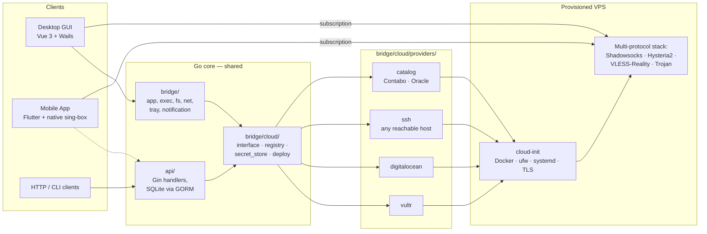

# Architecture

**English** | [中文](ARCHITECTURE.zh-CN.md)

PrivateDeploy is three coordinated pieces that share a Go core:

1. A **desktop app** (Vue 3 + Wails) that runs locally, deploys VPS nodes, and connects via sing-box.
2. A **mobile app** (Flutter, Android + iOS) that talks to the same providers and runs sing-box natively.
3. A **standalone HTTP API** (Go + Gin) that exposes the same operations for headless / CI / multi-device use.

All three reuse the same cloud-provider abstraction and protocol catalog from `bridge/cloud/`.

## Topology

## Module map

| Path | Purpose |
| --- | --- |
| `main.go` | Wails entry point — embeds `frontend/dist`, wires tray, lifecycle. |
| `bridge/` | Desktop runtime: app shell, exec, filesystem, network, mDNS-style discovery, system tray, notifications. |
| `bridge/cloud/interface.go` | `CloudProvider` and `LatencyTester` interfaces — the contract every provider implements. |
| `bridge/cloud/registry.go` | Provider registration + lookup. |
| `bridge/cloud/secret_store.go` | API-key persistence with OS keyring. |
| `bridge/cloud/deploy/` | Deploy policy + cloud-init bundle generation. |
| `bridge/cloud/health/` | Per-node health and readiness checks. |
| `bridge/cloud/providers/vultr/` | Vultr API client + region latency probe + user-data recovery. |
| `bridge/cloud/providers/digitalocean/` | DigitalOcean API client + readiness polling. |
| `bridge/cloud/providers/ssh/` | Bring-your-own-host provider over SSH (host-key pinning, sessions). |
| `bridge/cloud/providers/catalog/` | Catalog providers backed by static plan data — Contabo, Oracle. |
| `frontend/` | Vue 3 + Pinia desktop UI. Stores under `src/stores/`, views under `src/views/`. |
| `mobile/` | Flutter app. Native VPN service in `mobile/android/.../PrivateDeployVpnService.kt`. |
| `mobile/lib/features/` | Feature modules (nodes, profiles, settings, vpn, cloud, …). |
| `api/` | Standalone Gin HTTP server. SQLite via GORM (`api/handlers/`, `api/middleware/`, `api/routes/`). |
| `e2e/run_cloud_ui_e2e.py` | Playwright cloud-UI regression — uses isolated `127.0.0.1:4174`, refuses port 7890. |
| `scripts/quality_gate.sh` | One-command gate: Go (root + api) + frontend type-check + lint + tests, with coverage summary. |
| `scripts/check_versions.sh` | Enforces `VERSION`, `MOBILE_BUILD_NUMBER`, `wails.json`, `frontend/package.json`, `mobile/pubspec.yaml`, and `bridge/bridge.go` `AppVersion` are all in sync. |

## Versioning

Single source of truth at the repo root:

- `VERSION` — semantic version shared by desktop + frontend.
- `MOBILE_BUILD_NUMBER` — monotonic mobile build number (appended as `+N` to the mobile version).
- `bridge/bridge.go` declares `var AppVersion = "dev"` and the **default must stay `"dev"`** — release versions are injected via `-ldflags '-X privatedeploy/bridge.AppVersion=X.Y.Z'`.

`scripts/sync_versions.sh` writes the values from `VERSION`/`MOBILE_BUILD_NUMBER` into `wails.json`, `frontend/package.json`, and `mobile/pubspec.yaml`. `scripts/check_versions.sh` is run by every CI workflow (`build.yml`, `release.yml`, `mobile-ci.yml`, `mobile-test.yml`) so a missed sync fails before any build runs.

## Deployment flow

1. Client (desktop / mobile / API) selects provider + region + plan.
2. `bridge/cloud/deploy/` builds a cloud-init bundle: Docker, ufw, systemd units, TLS, plus per-protocol secrets (random ports, passwords, UUIDs, Reality keypair).
3. Provider creates the VPS with the bundle as user-data.
4. `health/` polls readiness; secrets persist locally (keyring on desktop, secure storage on mobile).
5. Generated subscription is injected into the active sing-box profile so the client rotates across all available protocols on that node.

Reality public key + short ID land at `/etc/privatedeploy/vless/reality.txt` on the VPS and are surfaced in the UI for clients that need manual configuration.

## Tests and quality gates

| Layer | Tooling | Command |
| --- | --- | --- |
| Go (desktop core + providers) | `go test` + coverage | `go test ./...` from repo root |
| Go (HTTP API) | `go test` + coverage | `cd api && go test ./...` |
| Frontend | `vue-tsc`, `oxlint` + `eslint`, `vitest` | `cd frontend && pnpm run type-check && pnpm run lint:ci && pnpm run test:coverage` |
| Mobile | `flutter test` (unit + widget + golden) | `cd mobile && flutter test` |
| Cloud UI e2e | Playwright (Python) | `python3 e2e/run_cloud_ui_e2e.py` |
| All in one | — | `./scripts/quality_gate.sh` |

Vulnerability scanning runs in CI via `govulncheck` (root + api) and `pnpm audit` (frontend).
