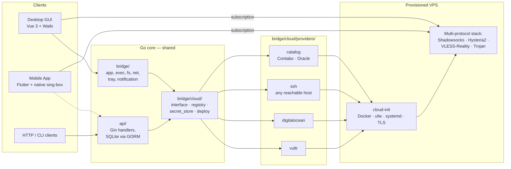

# 架构

[English](ARCHITECTURE.md) | **中文**

PrivateDeploy 由三个协同的部分组成,共享同一个 Go 核心:

1. **桌面应用**(Vue 3 + Wails)—— 本地运行,部署 VPS 节点,通过 sing-box 连接。
2. **移动应用**(Flutter,Android + iOS)—— 对接相同的云厂商,原生运行 sing-box。
3. **独立 HTTP API**(Go + Gin)—— 把相同的操作暴露给无界面 / CI / 多设备场景。

三者复用 `bridge/cloud/` 中同一套云厂商抽象与协议目录。

## 拓扑

## 模块映射

| 路径 | 用途 |
| --- | --- |
| `main.go` | Wails 入口 —— 嵌入 `frontend/dist`,接好托盘、生命周期。 |
| `bridge/` | 桌面运行时:应用外壳、exec、文件系统、网络、类 mDNS 发现、系统托盘、通知。 |
| `bridge/cloud/interface.go` | `CloudProvider` 与 `LatencyTester` 接口 —— 每个 provider 必须实现的契约。 |
| `bridge/cloud/registry.go` | Provider 注册与查找。 |
| `bridge/cloud/secret_store.go` | 借助操作系统钥匙串持久化 API key。 |
| `bridge/cloud/deploy/` | 部署策略 + cloud-init 引导包生成。 |
| `bridge/cloud/health/` | 各节点的健康与就绪检查。 |
| `bridge/cloud/providers/vultr/` | Vultr API 客户端 + 区域延迟探测 + user-data 恢复。 |
| `bridge/cloud/providers/digitalocean/` | DigitalOcean API 客户端 + 就绪轮询。 |
| `bridge/cloud/providers/ssh/` | 通过 SSH 的自带主机 provider(主机密钥固定、会话管理)。 |
| `bridge/cloud/providers/catalog/` | 基于静态套餐数据的目录式 provider —— Contabo、Oracle。 |
| `frontend/` | Vue 3 + Pinia 桌面 UI。Store 在 `src/stores/`,视图在 `src/views/`。 |
| `mobile/` | Flutter 应用。原生 VPN 服务在 `mobile/android/.../PrivateDeployVpnService.kt`。 |
| `mobile/lib/features/` | 功能模块(nodes、profiles、settings、vpn、cloud 等)。 |
| `api/` | 独立的 Gin HTTP 服务器。通过 GORM 使用 SQLite(`api/handlers/`、`api/middleware/`、`api/routes/`)。 |
| `e2e/run_cloud_ui_e2e.py` | Playwright 云 UI 回归 —— 使用隔离的 `127.0.0.1:4174`,拒绝 7890 端口。 |
| `scripts/quality_gate.sh` | 一键门禁:Go(root + api)+ 前端类型检查 + lint + 测试,并附覆盖率汇总。 |
| `scripts/check_versions.sh` | 强制 `VERSION`、`MOBILE_BUILD_NUMBER`、`wails.json`、`frontend/package.json`、`mobile/pubspec.yaml` 与 `bridge/bridge.go` 的 `AppVersion` 全部一致。 |

## 版本管理

唯一真相来源位于仓库根:

- `VERSION` —— 桌面 + 前端共享的语义版本号。
- `MOBILE_BUILD_NUMBER` —— 单调递增的移动构建号(以 `+N` 追加到移动版本)。
- `bridge/bridge.go` 声明 `var AppVersion = "dev"`,且**默认必须保持 `"dev"`** —— 发布版本通过 `-ldflags '-X privatedeploy/bridge.AppVersion=X.Y.Z'` 注入。

`scripts/sync_versions.sh` 把 `VERSION`/`MOBILE_BUILD_NUMBER` 的值写入 `wails.json`、`frontend/package.json` 和 `mobile/pubspec.yaml`。每个 CI workflow(`build.yml`、`release.yml`、`mobile-ci.yml`、`mobile-test.yml`)都会运行 `scripts/check_versions.sh`,这样漏同步会在任何构建开始前就失败。

## 部署流程

1. 客户端(桌面 / 移动 / API)选择 provider + 区域 + 套餐。
2. `bridge/cloud/deploy/` 构建 cloud-init 引导包:Docker、ufw、systemd 单元、TLS,以及各协议的密钥(随机端口、密码、UUID、Reality 密钥对)。
3. Provider 用该引导包作为 user-data 创建 VPS。
4. `health/` 轮询就绪;密钥本地持久化(桌面用钥匙串,移动用安全存储)。
5. 生成的订阅注入当前 sing-box profile,客户端便能在该节点的所有可用协议间轮换。

Reality 公钥 + short ID 落在 VPS 的 `/etc/privatedeploy/vless/reality.txt`,并在 UI 中展示,供需要手动配置的客户端使用。

## 测试与质量门禁

| 层 | 工具 | 命令 |
| --- | --- | --- |
| Go(桌面核心 + provider) | `go test` + 覆盖率 | 仓库根执行 `go test ./...` |
| Go(HTTP API) | `go test` + 覆盖率 | `cd api && go test ./...` |
| 前端 | `vue-tsc`、`oxlint` + `eslint`、`vitest` | `cd frontend && pnpm run type-check && pnpm run lint:ci && pnpm run test:coverage` |
| 移动 | `flutter test`(单元 + widget + golden) | `cd mobile && flutter test` |
| 云 UI e2e | Playwright(Python) | `python3 e2e/run_cloud_ui_e2e.py` |
| 一键全跑 | — | `./scripts/quality_gate.sh` |

漏洞扫描在 CI 中通过 `govulncheck`(root + api)和 `pnpm audit`(前端)运行。
